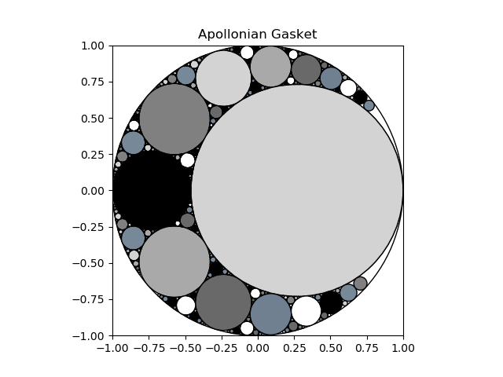
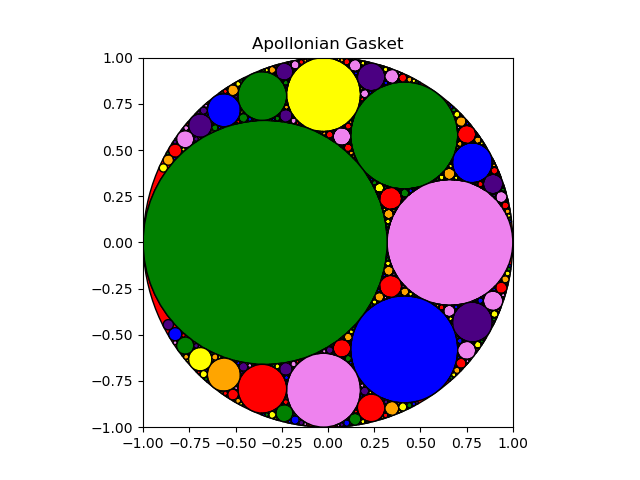

# ApollonianGasket
Apollonian Gasket

- [Dana Mackenzie AmSci articel](https://www.americanscientist.org/article/a-tisket-a-tasket-an-apollonian-gasket)
- [useful Ivars Peterson pdf](https://maths.ac-noumea.nc/amc/docs/circle_game.pdf)
- [Lagarias, Mallows, Wilks paper](https://arxiv.org/abs/math/0101066)






- assumes circle #1 has radius=1 and contains all other 
circles (i.e., has a *negative* curvature or bend)
- assumes circles #2 and #3 both have y=0
- allows user to choose x of circle #2 (which determines
center and radius of circle #3)
- learned some matplotlib ([patches](https://matplotlib.org/stable/api/_as_gen/matplotlib.patches.Circle.html))
- learned python has complex numbers!
- learned the [click library](https://click.palletsprojects.com/en/8.0.x/)

## algorithm summary

- given 3 circles, all tangent, where first circle contains other two
- calculate bends for each circle:
```
a = -1
b = 1/r2
c = 1/r3
```
- calculate bend-times-center for each circle:
```
A = a*(x1 + y1*j)
B = b*(x2 + y2*j)
C = c*(x3 + y3*j)
```
- use Descartes' formula to calculate `d=1/r4` (with two possible solutions)
```
d = a + b + c +/- 2*sqrt(ab + ac + bc)
```
- use Lagarias/Mallows/Wilks formula to calculate `D=d(x4 + y4*j)` (also 
with two possible solutions)
```
D = (A + B + C) +/- (2*cmath.sqrt(A*B + A*C + B*C))
```
- we now have a fourth circle...recur on possible combinations:
```
given A, B, D, find next tangent circle to those three
given A, C, D, find next tangent circle to those three
given C, B, D, find next tangent circle to those three
```
- keep going until some max level of recursion is reached (e.g., 7)
- save all circles as you go, plot them at the end

## still to do

- add bend numbers to center of each circle
- figure out better way to not include duplicates (e.g., avoid adding 
x=1.77e-15, y=0, r=0.99999 since it's really just the same as circle #1)
